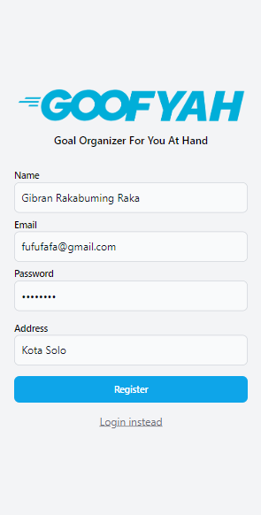
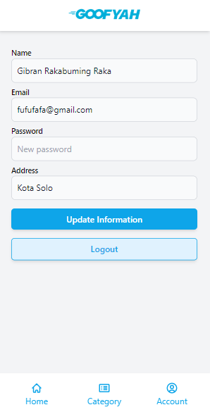
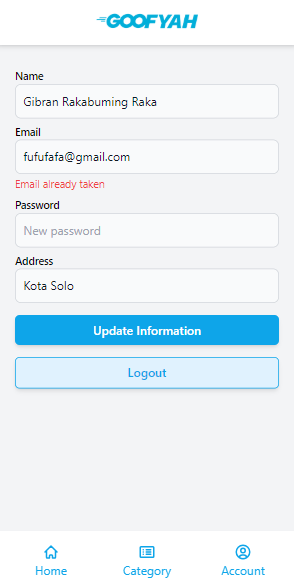
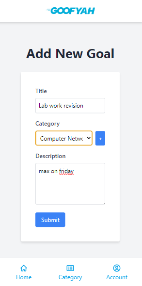
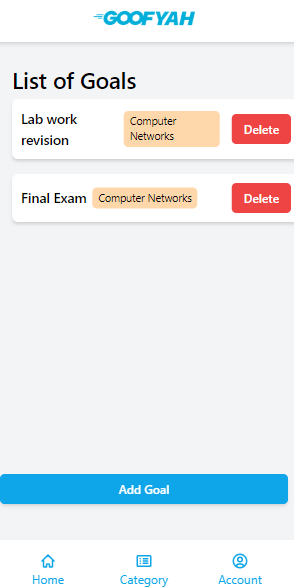
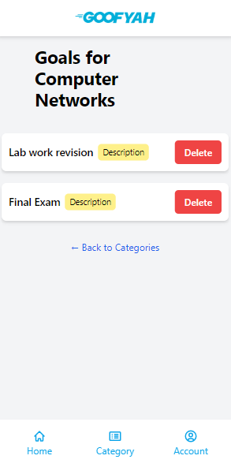

 
| Name           | NRP        | Class     |
| ---            | ---        | ----------|
| Ralfazza Rajariandhana | 5025221081 | IUP |
| Tabina Callistadya | 5025221318 | IUP |

## App demo video
https://youtu.be/Nc03xjABxcw

## About
GOal Organizer For You At Hand or GOOFYAH is a web application where users can list their goals that they want to do. Users can also categorized their goals to organize it.

This project uses Gin Web Framework utilizing GORM and tailwindcss for the frontend. Make sur go is installed then run it with <code>go run .</code>

## Project Directory
| Directory | Description |
| --- | --- |
| ./controllers | Processing any requests from the front end to the model and return it to front end |
| ./database | Connects to database and migrates all models |
| ./middleware | Make sure only authenticated and authorized user to be able to access the page |
| ./models | Define the model and methods that directly access the database |
| ./public | Resources |
| ./routes | Sets all routing and applies middleware |
| ./seeder | Seeds database with some data |
| ./views | HTML templates |

## Database and Model Structure
| Model | Relation |
| - | - |
| User to Category | has many |
| Category to User | belongs to |
| Category to Goal | has many |
| Goal to Category | belongs to|

## CRUD Features
| Model | Type | Route | Controller | Method |
| - | - | - | - | - |
| User | Create | /login | AuthController | RegisterStore |
| User | Read | /user | AuthController | Show |
| User | Update | /user/update | AuthController | Update |
| Goal | Create | /goals/addNewGoal | GoalController | NewGoalSingle |
| Goal | Read | / | GoalController | Index |
| Goal | Read | /goals/:ID | GoalController | ShowGoal |
| Goal | Delete | /goals/delete/:ID | GoalController | DeleteGoal |
| Categories | Create | /categories/listcategories | CategoriesController | CreateCategory |
| Categories | Read | /categories/listcategories | CategoriesController | Index |
| Categories | Read | /categories/:ID | CategoriesController | ShowCategoryGoals |
| Categories | Delete | /categories/delete/:ID | CategoriesController | DeleteCategories |

Note that since a goal belongs to a category, when the category is deleted then all goals belonged to that category is deleted as well. This also applies for when a user is deleted, the whole category of that user is deleted as well.

## Passing Data to Frontend
We could use the following format to pass data from controller to front end.
#### Controller
```go
variableX := "valueX",
c.HTML(http.StatusOK, htmlFileName, gin.H{
    "title": pageTitle,
    "variableX": variableX,
})
```
#### HTML
```html
{{ .variableX }}
```

## JWT for Authentication and Session
To ensure a secure web app we use JWT to create sessions and store the user of the logged in user. To access authenticated we can use <code>user, _ := c.Get("user")</code>

##
||||
|-|-|-|
||||
||||